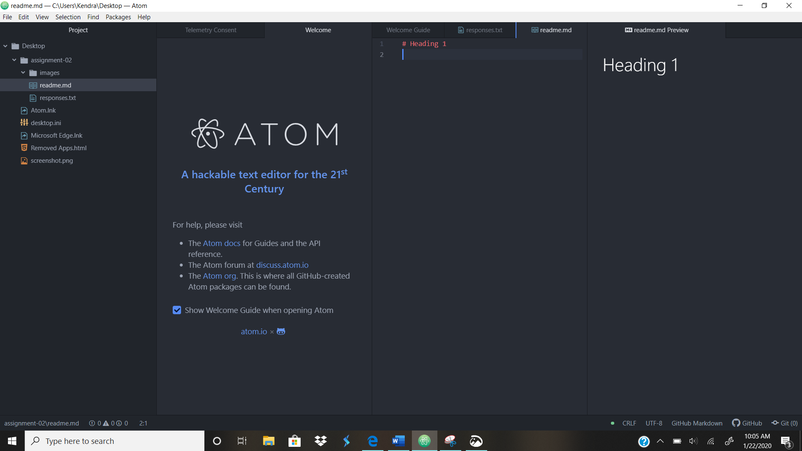

# Assignment 2
## Kendra Bottenberg
I took this class because I needed an upper division credit to graduate and this was one of the only ones that didn't require a prereq.
I've learned how the internet works, what the web is, and how URL's work.
[Moodle](https://moodle.umt.edu/)

[My responses](./responses.txt)

