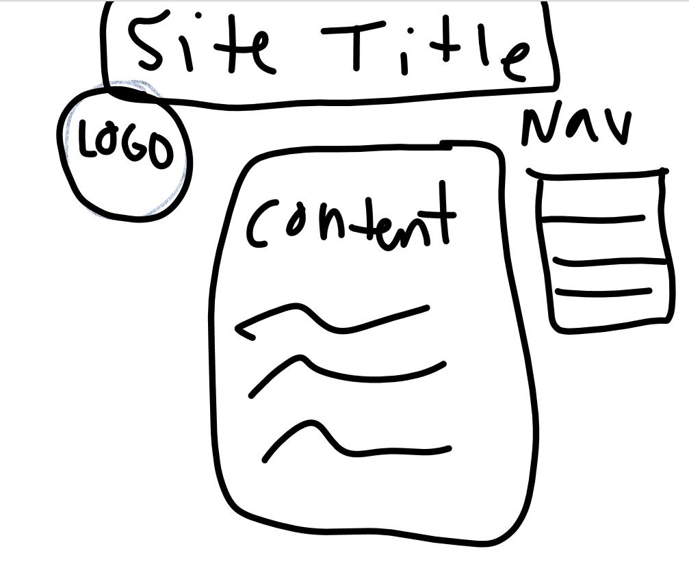

Padding is the space between things within an element and margins is the space between different elements. Borders is the outside edge of an element.

My work cycle for this assignment was very frustrating. I had a really hard time getting the right spacing for placing things on the page and im assuming there is an easier way but i couldnt figure it out. Other than that and my semi colon issues I understood this one pretty well.
